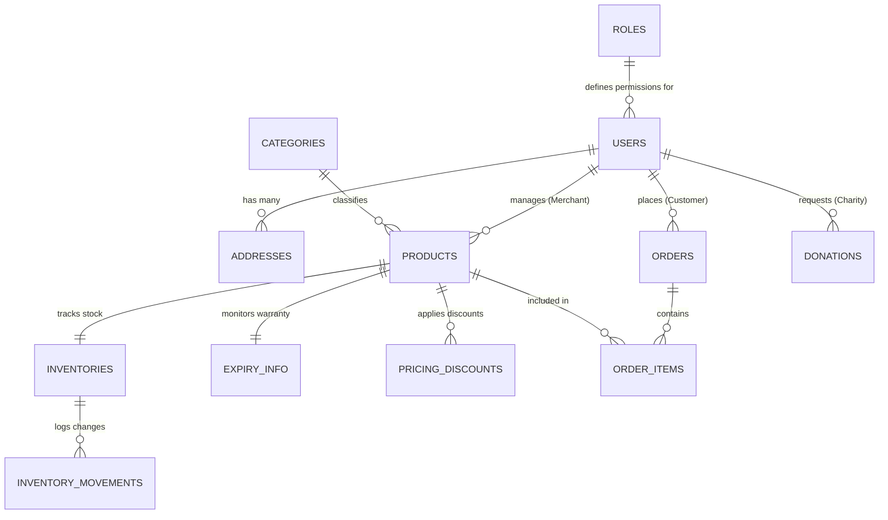

# Smart Warranty Platform - Database Schema & Architecture

This document details the database design, entity relationships, migration procedures, and integrity constraints for the **Smart Warranty Platform**.

## Architecture & Relational Overview

The database is built on **Prisma ORM** with **SQLite** for development (easily configurable to **PostgreSQL** in production).



---

## Core Tables (13 Entities)

### 1. `roles`
Stores user roles and JSON permission lists.
- **Primary Key**: `id` (UUID)
- **Fields**: `name` (Unique), `description`, `permissions` (JSON string)
- **Supported Roles**: `Customer`, `Merchant`, `Charity`, `Admin`

### 2. `users`
Stores user identity, authentication hashes, and role relations.
- **Primary Key**: `id` (UUID)
- **Foreign Key**: `roleId` -> `roles.id` (`ON DELETE RESTRICT`)
- **Indexes**: `email` (Unique), `roleId`

### 3. `addresses`
Stores user shipping and billing location profiles.
- **Primary Key**: `id` (UUID)
- **Foreign Key**: `userId` -> `users.id` (`ON DELETE CASCADE`)

### 4. `categories`
Hierarchical product categorization supporting self-referential parent categories.
- **Primary Key**: `id` (UUID)
- **Foreign Key**: `parentId` -> `categories.id` (`ON DELETE SET NULL`)

### 5. `products`
Core warranty-backed products catalog.
- **Primary Key**: `id` (UUID)
- **Foreign Keys**:
  - `merchantId` -> `users.id` (`ON DELETE RESTRICT`)
  - `categoryId` -> `categories.id` (`ON DELETE SET NULL`)
- **Indexes**: `barcode` (Unique), `merchantId`, `categoryId`, `status`, `expiryDate`

### 6. `inventories`
Real-time stock level tracker linked 1-to-1 with products.
- **Foreign Key**: `productId` -> `products.id` (`ON DELETE CASCADE`)

### 7. `inventory_movements`
Audit log recording every stock addition, deduction, or adjustment.
- **Foreign Keys**:
  - `inventoryId` -> `inventories.id` (`ON DELETE CASCADE`)
  - `createdById` -> `users.id` (`ON DELETE RESTRICT`)

### 8. `orders` & 9. `order_items`
Customer order transactions and individual line items.
- **Foreign Keys**:
  - `customerId` -> `users.id` (`ON DELETE RESTRICT`)
  - `orderId` -> `orders.id` (`ON DELETE CASCADE`)
  - `productId` -> `products.id` (`ON DELETE RESTRICT`)

### 10. `expiry_info`
Warranty and product expiration monitoring entity.
- **Foreign Key**: `productId` -> `products.id` (`ON DELETE CASCADE`)

### 11. `pricing_discounts`
Dynamic pricing and discount schedule entity.
- **Foreign Key**: `productId` -> `products.id` (`ON DELETE CASCADE`)

### 12. `donations`
Charity organization donation requests and distribution.
- **Foreign Keys**:
  - `charityId` -> `users.id` (`ON DELETE RESTRICT`)
  - `productId` -> `products.id` (`ON DELETE RESTRICT`)

### 13. `notifications`
User notifications for warranty alerts, order updates, and system events.
- **Foreign Key**: `userId` -> `users.id` (`ON DELETE CASCADE`)

---

## Execution & Migration Instructions

```bash
# 1. Generate Prisma Client
npx prisma generate

# 2. Run Database Migrations
npx prisma migrate dev --name init

# 3. Seed Default System Roles and Admin
npx tsx prisma/seed.ts
```
